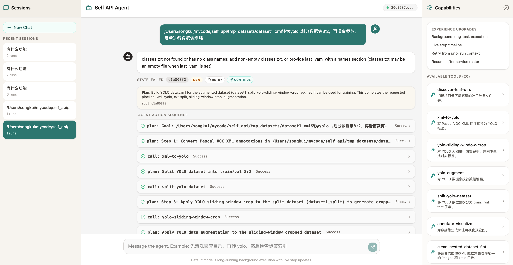

# self_api - 图像/数据集预处理 Agent API



用于图像与图像数据集预处理的 Agent API 服务。内建 Agent 前端支持会话列表、长任务状态、步骤时间线、工具能力侧栏，以及失败原因回显。

## 功能

当前提供 12 个核心工具能力：

1. 指定目录图像按滑窗规则裁剪并保存
2. Pascal VOC XML 标注转换为 YOLO 标注
3. YOLO 数据集按 train/val/test 划分
4. 指定目录打包为 zip 压缩包
5. 指定 zip 压缩包解压到目标目录
6. 文件或文件夹整体移动到目标目录
7. 文件或文件夹整体复制到目标目录
8. 跨机器 SFTP 远程传输
9. YOLO 大图滑窗裁剪为小图数据集
10. 递归发现多层目录中的最底层叶子数据目录
11. 递归清洗多层目录中的图像/XML 数据并归类为 `images` / `xmls`
12. 汇总多个子目录处理结果为统一数据集目录

## 快速启动

### 环境配置

先复制环境变量模板：

```bash
cp .env.example .env
```

按实际环境修改 `.env` 中的必要项。常见需要关注的配置：

- `SELF_API_STORAGE_ROOT`
- `SELF_API_PUBLISH_PORT`
- `UID`
- `GID`
- 认证或上游服务相关配置

### 本地启动

```bash
python -m venv .venv
source .venv/bin/activate
pip install -e ".[dev]"
make run
```

启动后可访问：

- `http://127.0.0.1:8666/agent-ui`
- `http://<你的内网IP>:8666/agent-ui`

如需自定义地址或端口：

```bash
make run HOST=0.0.0.0 PORT=9000
```

### Docker Compose 启动

```bash
docker compose up -d --build
```

查看日志：

```bash
docker compose logs -f
```

停止服务：

```bash
docker compose down
```

启动后可访问：

- `http://127.0.0.1:8666/agent-ui`
- `http://<你的内网IP>:8666/agent-ui`

### 常用命令

```bash
make run
make test
make lint
docker compose up -d --build
docker compose logs -f
docker compose down
```

## 文档

- 详细项目说明：[docs/project-reference.md](./docs/project-reference.md)
- 接口调用示例：[docs/api_examples.md](./docs/api_examples.md)
